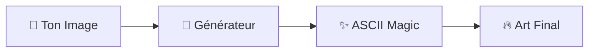

<div align="center">

# ✨ ASCII-ART ✨

```
      ░█████╗░░██████╗░█████╗░██╗██╗  ░█████╗░██████╗░████████╗
      ██╔══██╗██╔════╝██╔══██╗██║██║  ██╔══██╗██╔══██╗╚══██╔══╝
      ███████║╚█████╗░██║░░╚═╝██║██║  ███████║██████╔╝░░░██║░░░
      ██╔══██║░╚═══██╗██║░░██╗██║██║  ██╔══██║██╔══██╗░░░██║░░░
      ██║░░██║██████╔╝╚█████╔╝██║██║  ██║░░██║██║░░██║░░░██║░░░
      ╚═╝░░╚═╝╚═════╝░░╚════╝░╚═╝╚═╝  ╚═╝░░╚═╝╚═╝░░╚═╝░░░╚═╝░░░
```


### 🌟 **L'art textuel n'a jamais été aussi beau** 🌟

[](https://noctavia.github.io/ASCII-ART/)
[](https://github.com/noctavia)

</div>

---

<div align="center">

## 🔮 **Magie Pure** 🔮

*Transforme tes images en œuvres d'art ASCII époustouflantes*

</div>

<table align="center">
<tr>
<td align="center" width="33%">

### 🎨 **Art Instantané**
Conversion magique en temps réel

</td>
<td align="center" width="33%">

### ⚡ **Ultra Rapide**
Performance optimisée

</td>
<td align="center" width="33%">

### 🎯 **Personnalisable**
Ajuste selon tes envies

</td>
</tr>
</table>

---

<div align="center">

## 🚀 **Comment ça marche ?**



### 💫 **En 3 clics seulement** 💫

</div>

<div align="center">

```bash
┌─ Étape 1 ────────────────┐    ┌─ Étape 2 ────────────────┐    ┌─ Étape 3 ────────────────┐
│  📤 Upload ton image     │ ➤  │  ⚙️  Ajuste les réglages │ ➤  │  🎉 Admire le résultat   │
│  Glisse & dépose !      │    │  Taille, contraste...    │    │  Copie, partage, enjoy ! │
└──────────────────────────┘    └──────────────────────────┘    └──────────────────────────┘
```

</div>

---

<div align="center">

## 🌈 **Pourquoi c'est génial ?**

<details>
<summary>🎯 <b>Fonctionnalités de ouf</b></summary>

```
🖼️  Support multi-formats     📱  Design responsive        🎨  Filtres avancés
⚡  Traitement instantané      🔧  Contrôles intuitifs      💾  Export facile
🌙  Interface élégante        🎭  Styles personnalisables   ✨  Résultats époustouflants
```

</details>

</div>

---

<div align="center">

### 🎪 **Prêt pour l'aventure ASCII ?** 🎪

<a href="https://noctavia.github.io/ASCII-ART/">

</a>

---

*Fait avec* 💜 *et beaucoup de* ✨

**« L'art ASCII, c'est la poésie du code »** 🎭


</div>
